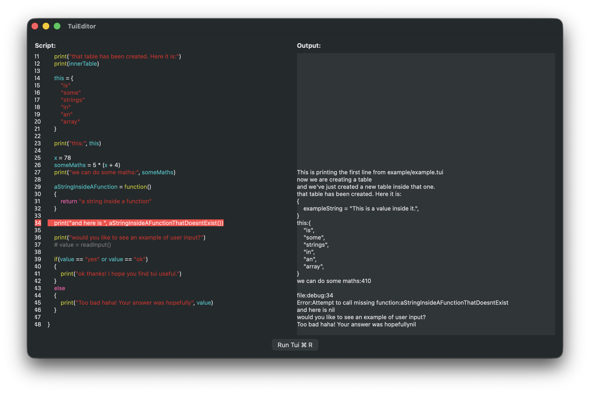

A simple IDE for the [Tui Scripting Language](https://github.com/mjdave/tui)

Currently supports the following basic features:
- Opening and saving files
- Line numbers
- Syntax highlighting
- Running the script
- Displaying the output

Current functionality is a bit flakey, but it mostly works for what it is. Code completion would make the editor considerably more useful and is a possible upcoming feature.